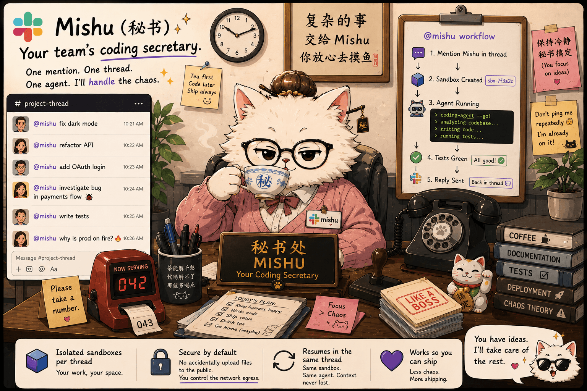

# Mishu



Mishu is a Slack bot that lets a team run coding-agent work from a shared thread.
Mention the bot, and it starts a coding-agent CLI inside an isolated `sbx` sandbox, then replies in
the same thread. Follow-up mentions in that thread resume the same sandbox and agent session.

The router is deliberately small: it does not call an LLM, classify intent, or decide whether to
delegate. It moves Slack thread text to a coding agent, captures the result, and keeps each Slack
thread mapped to one sandbox.

## Features

- One Slack thread maps to one sandbox and one agent session.
- Follow-up mentions resume the same coding-agent context.
- Different threads can run in parallel.
- Sandboxes keep per-thread state under `~/.agent-state/`.
- The coding agent can push or open a PR when the sandbox has GitHub credentials.
- Boundary logs are written as JSONL for debugging and audits.

## Requirements

- Node.js 22+ on the host running Mishu. The maintained Pi sandbox template includes Node.js 24
  for the Pi CLI.
- The Docker Sandboxes `sbx` CLI
- A Slack app with Socket Mode enabled
- A target git repo
- A Codex or Claude Code credential configured in `sbx`; Pi uses provider API-key env vars

For PR creation, the target repo should have a pushable `origin`, and the sandbox needs a repo-scoped
GitHub credential:

```bash
sbx secret set -g github
```

## Setup

### 1. Install dependencies

```bash
npm install
```

### 2. Configure the coding-agent credential

Codex is the default agent:

```bash
npm run setup
```

To set up Claude Code instead:

```bash
MISHU_AGENT=claude npm run setup
```

The setup command checks `sbx secret ls` and runs the needed interactive login flow.

### 3. Create the Slack app

Create an app at <https://api.slack.com/apps>, enable Socket Mode, and add these scopes:

| Token | Scopes |
| --- | --- |
| App-level token | `connections:write` |
| Bot token | `app_mentions:read`, `chat:write`, `reactions:write`, `channels:history`, `groups:history` |

Subscribe the app to the `app_mention` bot event, install it to your workspace, and invite it to the
channels where it should work.

Create `.env` from [.env.example](./.env.example):

```bash
APP_SLACK_APP_TOKEN=xapp-...
APP_SLACK_BOT_TOKEN=xoxb-...
```

### 4. Run Mishu

```bash
npm run build
MISHU_REPO=/path/to/your/repo \
  node --env-file=.env dist/cli/index.js --sandbox=sbx ./data
```

When Mishu prints `listening`, mention the bot in Slack.

## Configuration

| Variable | Required | Description |
| --- | --- | --- |
| `APP_SLACK_APP_TOKEN` | Yes | Slack app-level Socket Mode token (`xapp-...`). |
| `APP_SLACK_BOT_TOKEN` | Yes | Slack bot user token (`xoxb-...`). |
| `MISHU_REPO` | Yes | Repo path or ref passed to `sbx create --clone`. |
| `MISHU_AGENT` | No | `codex`, `claude`, or `pi`; default is `codex`. |
| `MISHU_SANDBOX_TEMPLATE` | No | Optional `sbx create --template` image. The image must include `bash`, `git`, and the selected agent CLI. |
| `MISHU_SANDBOX_DOCKERFILE` | No | Optional local Dockerfile to build, load into `sbx`, and use as the sandbox template. Mutually exclusive with `MISHU_SANDBOX_TEMPLATE`. |
| `MISHU_PI_PROVIDER` | Yes, for Pi | Provider for `MISHU_PI_API_KEY`; `anthropic`, `deepseek`, `google`, or `openai`. Only valid with `MISHU_AGENT=pi`. |
| `MISHU_PI_API_KEY` | Yes, for Pi | Provider API key injected into Pi turns as an environment variable. You may also set the selected provider's native env var instead. |
| `MISHU_PI_MODEL` | No | Optional Pi model override, for example `deepseek/deepseek-chat`. When omitted, Mishu uses a provider default. |
| `MISHU_LOG_LEVEL` | No | `summary` or `verbose`; default is `summary`. |
| `MISHU_BOT_USER` | No | Slack bot user id; resolved with `auth.test` when omitted. |

## Sandbox Governance & Security

Mishu does not manage sandbox egress or network policy in code. When using `sbx` as the sandbox
provider, configure Docker Sandboxes governance and local policy outside Mishu:
<https://docs.docker.com/ai/sandboxes/governance/local/>.

If `MISHU_SANDBOX_TEMPLATE` is set, Mishu passes it to `sbx create --template` for future sandbox
creation. Custom templates must include `bash`, `git`, and the selected agent CLI.

If `MISHU_SANDBOX_DOCKERFILE` is set, Mishu builds the Dockerfile at startup, exports the resulting
image, loads it with `sbx template load`, and passes the generated local image tag to
`sbx create --template`. The Dockerfile's directory is used as the build context. Do not set
`MISHU_SANDBOX_TEMPLATE` and `MISHU_SANDBOX_DOCKERFILE` at the same time.

Pi is not a native Docker Sandboxes agent yet. For `MISHU_AGENT=pi`, Mishu creates an `sbx shell`
sandbox and requires either `MISHU_SANDBOX_TEMPLATE` or `MISHU_SANDBOX_DOCKERFILE`. The maintained
Dockerfile is [sandbox-templates/pi/Dockerfile](./sandbox-templates/pi/Dockerfile):

```bash
# With DEEPSEEK_API_KEY=sk-... in .env:
MISHU_AGENT=pi \
MISHU_SANDBOX_DOCKERFILE="$PWD/sandbox-templates/pi/Dockerfile" \
MISHU_PI_PROVIDER=deepseek \
MISHU_REPO=/path/to/your/repo \
  node --env-file=.env dist/cli/index.js --sandbox=sbx ./data
```

Pi is API-key-only in Mishu for now. Set `MISHU_PI_PROVIDER` and either `MISHU_PI_API_KEY` or the
selected provider's native env var. Mishu injects the matching provider env var into the Pi process
only. Supported provider env mappings are: `anthropic -> ANTHROPIC_API_KEY`,
`deepseek -> DEEPSEEK_API_KEY`, `google -> GEMINI_API_KEY`, and `openai -> OPENAI_API_KEY`. Keys are
not passed in argv or router logs.

When `MISHU_PI_PROVIDER=deepseek`, Mishu automatically allows `api.deepseek.com:443` for each newly
created sbx sandbox. Docker organization governance can still override local sandbox policy rules.

## Logs

Each turn is logged to `./data/router.log` as JSONL. Summary logs include argv, prompt size/hash, exit
code, duration, and final-message snippet. Verbose logs also include raw stdout/stderr chunks.

```bash
tail -f ./data/router.log | jq 'select(.threadId=="t-<channel>-<thread-ts>")'
```

Credentials are not put in prompts or argv. Codex, Claude, and GitHub credentials are stored and
injected by `sbx`; Pi provider API keys are injected by Mishu into the Pi process environment.

## Development

Read [AGENTS.md](./AGENTS.md) before changing the router, sandbox, platform, or backend seams.

| Command | Description |
| --- | --- |
| `npm run check` | Biome check, TypeScript, and Vitest. This is the main gate. |
| `npm run check:fix` | Apply Biome fixes, then run the gate. |
| `npm test` | Run offline unit tests. |
| `npm run test:live` | Run live `sbx` tests. Requires the `sbx` daemon and is not part of CI. |
| `npm run build` | Compile `dist/`. |
| `npm run dev` | Run the CLI under `tsx watch`. |

## Architecture

```
Slack <-> PlatformAdapter <-> Router <-> SandboxProvider <-> sandbox
                                                          \-> CodingBackend
```

- `src/platform/`: Slack event mapping and Slack SDK adapter.
- `src/router/`: thread state machine, dedupe, sandbox naming, state store, logging, dispatcher, idle sweep.
- `src/sandbox/`: `sbx` argv builders and provider.
- `src/backend/`: Codex and Claude Code argument builders and output parsers.
- `src/cli/`: argument parsing, setup flow, and composition root.
